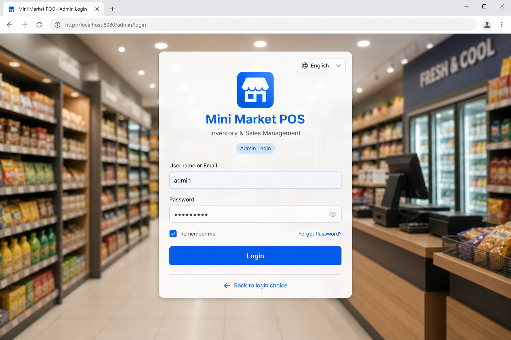
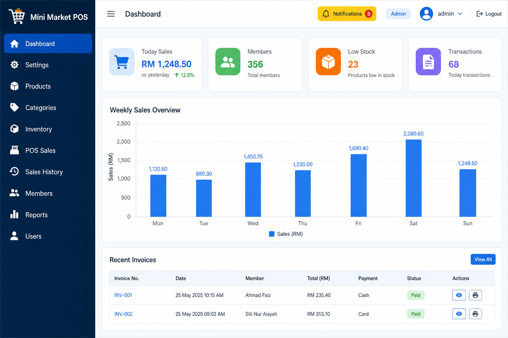
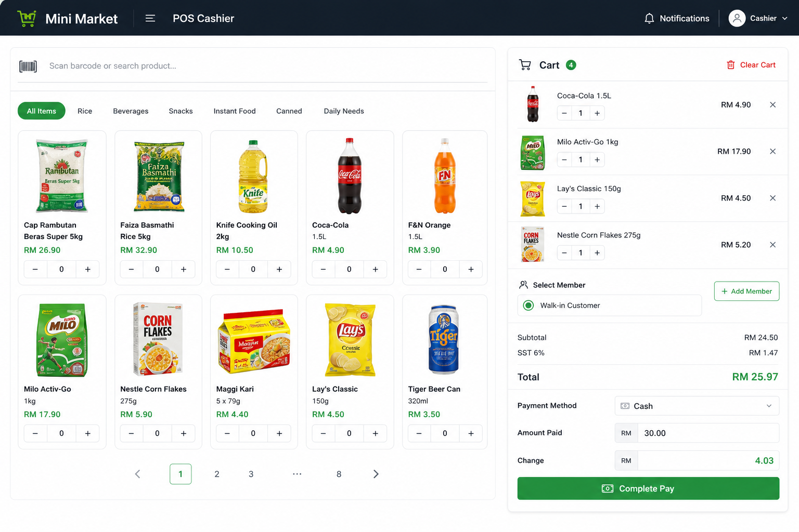
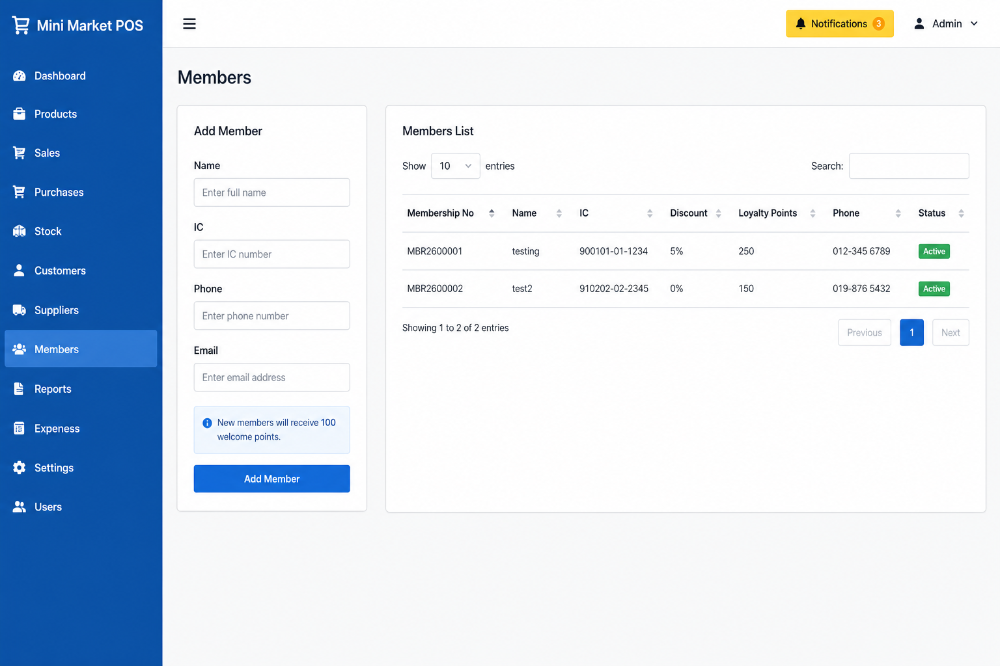
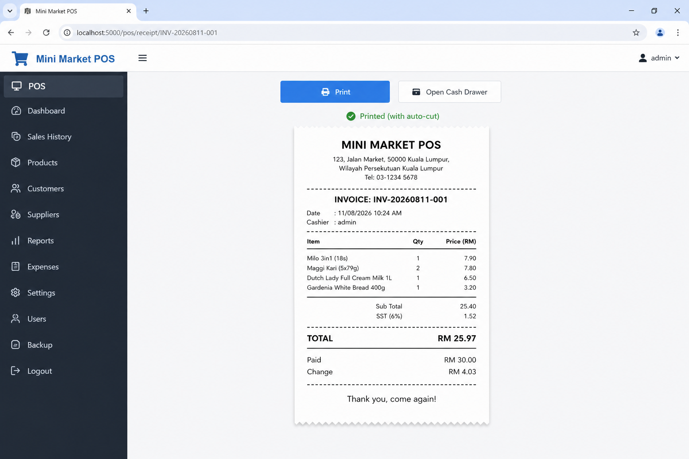
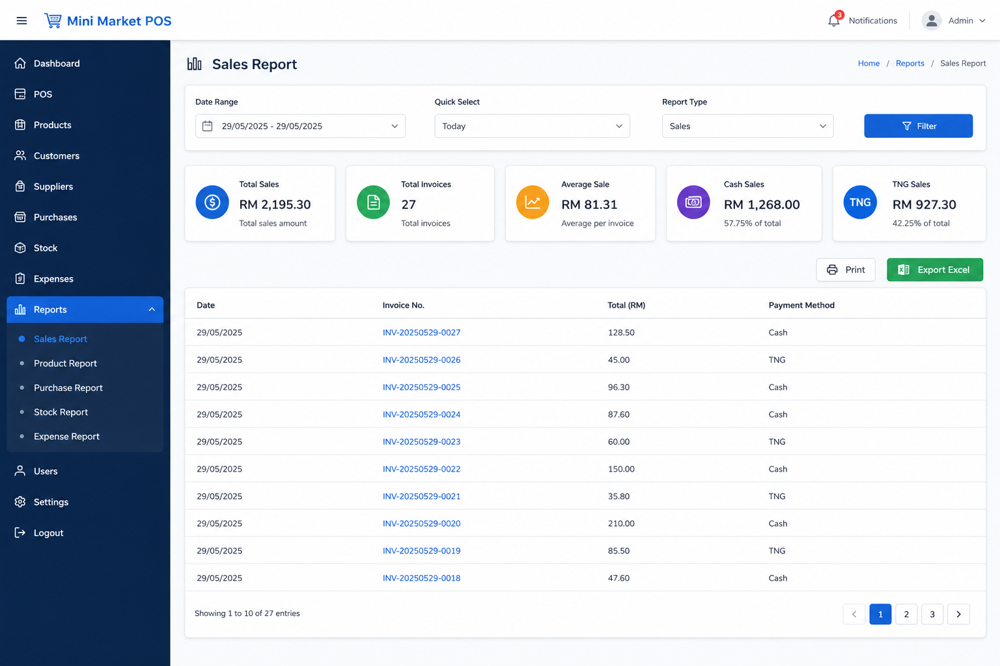

# 🛒 Mini Market POS System

A full-featured **Point of Sale** system for mini markets and retail shops, built with **PHP**, **MySQL**, **HTML**, **CSS**, and **JavaScript**.

Manage products, members, inventory, sales, thermal receipts, and cash drawer from one clean dashboard.

✨ Feel free to explore, contribute, and enhance the project! 🚀

---

## 🎬 Project Demo Video

📺 Watch the full system demo (login, POS checkout, members, receipts and more):

👉 **[Watch on Google Drive](https://drive.google.com/file/d/1tdF-f5Rj_zWO2uXBnjVrrlm7pf796hvy/view?usp=sharing)**

---

## ✨ Features

- 🔐 **Admin and Staff Login** — split login portal, role-based access, session and CSRF protection
- 📊 **Live Dashboard** — today / month sales, low-stock alerts, recent activity
- 📦 **Inventory** — products, categories, suppliers, purchases, stock adjustments
- 🛒 **POS Cashier** — barcode scan, cart, SST tax, cash / TNG checkout
- 👤 **Members and Loyalty** — add members from POS, welcome points, redeem at checkout
- 🧾 **Thermal Receipts** — 80mm ticket, local print agent, auto-cut, cash drawer kick
- 🔔 **Notifications** — unread badge on the bell; opening the page marks all as read
- 📑 **Reports** — sales / inventory / members with print and Excel export
- 🌍 **i18n** — English, Chinese, Bahasa Malaysia

---

## 🏗️ Tech Stack

| Category | Technology |
| --- | --- |
| 🖥️ Frontend | HTML5, CSS3, JavaScript, Bootstrap 5, Bootstrap Icons |
| 🔙 Backend | Native PHP 8+ (no framework) |
| 🗄️ Database | MySQL / MariaDB (`ekoperasi_db`) |
| 🔐 Security | PDO prepared statements, CSRF tokens, password_hash |
| 🖨️ Printing | Local USB print agent (Xprinter XP-80) |
| 🌐 Server | Apache (XAMPP / cPanel) |

---

## 🖼️ Project Screenshots

<p align="center">
  
  <br/>
  <em>🔐 Login Portal — Admin / Staff sign-in</em>
</p>

<table>
  <tr>
    <td width="50%" align="center">
      <br/>
      <strong>📊 Dashboard</strong><br/>
      <sub>Live sales stats and charts</sub>
    </td>
    <td width="50%" align="center">
      <br/>
      <strong>🛒 POS Cashier</strong><br/>
      <sub>Products, cart and checkout</sub>
    </td>
  </tr>
  <tr>
    <td width="50%" align="center">
      <br/>
      <strong>👤 Members</strong><br/>
      <sub>Register members and loyalty points</sub>
    </td>
    <td width="50%" align="center">
      <br/>
      <strong>🧾 Receipt</strong><br/>
      <sub>80mm ticket, print and cash drawer</sub>
    </td>
  </tr>
</table>

<p align="center">
  
  <br/>
  <em>📑 Reports — filters, print and Excel export</em>
</p>

---

## 📋 Requirements

- 💻 XAMPP (Apache + MySQL + PHP 8.0+) or a PHP hosting panel
- 🌐 Modern browser (Chrome / Edge / Firefox)
- 🖨️ Optional: USB thermal printer + print-agent for auto-cut / cash drawer

---

## 🚀 Installation

1. 📁 Place the project in your web root, for example:
   ```text
   C:\xampp\htdocs\Pos_System
   ```
2. ▶️ Start Apache and MySQL (XAMPP Control Panel).
3. 🗄️ Restore the database (pick one):
   - Double-click `import-database.bat`
   - Open `http://localhost/Pos_System/install-db.php`
   - Or run `php cli-install-db.php`
4. 🌐 Open the app:
   ```text
   http://localhost/Pos_System/
   ```

### 🔑 Default credentials

| Field | Value |
| --- | --- |
| 👨‍💼 Admin | `admin` / `admin123` |
| 🧾 Staff | `user` / `user123` |

> Change the default passwords after first login.

### ☁️ Deploying to cPanel / hosting

1. Copy `config/database.local.example.php` to `config/database.local.php`
2. Fill in your hosting MySQL name / user / password
3. Upload the project and run `install-db.php` once, then remove it

---

## 📁 Folder Structure

```text
Pos_System/
├── admin/
├── auth/
├── api/
├── config/
├── database/
├── docs/screenshots/
├── includes/
├── assets/
├── print-agent/
├── uploads/
├── install-db.php
├── README.md
├── CONTRIBUTING.md
└── LICENSE
```

---

## 🤝 Contributing

Contributions are welcome. Please read [CONTRIBUTING.md](CONTRIBUTING.md) before opening a pull request.

---

## 📝 License

This project is licensed under the [MIT Non-Commercial License](LICENSE).

---

## ©️ Copyright

Copyright (c) 2026 Eng Choon Hao. All Rights Reserved.

Unauthorized copying or redistribution of this project without permission is prohibited.

---

⭐ If you find this project helpful, please star the repository.
